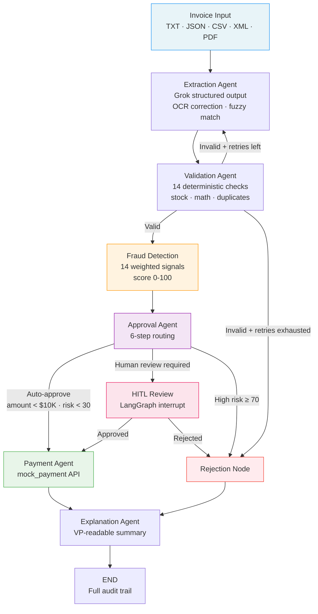
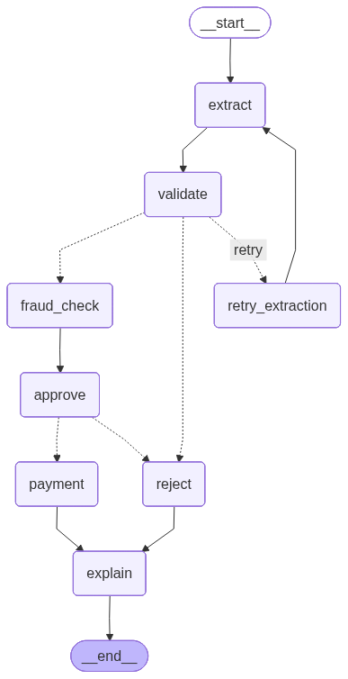

# Invoice Processing AI
### Multi-Agent System for Automated Accounts Payable Workflow

A production-grade multi-agent system built with **LangGraph + Grok** that automates the full invoice lifecycle: ingestion → validation → fraud detection → approval → payment → explainability. Includes a Streamlit HITL dashboard, CLI, batch mode, and 180 automated tests.

---

## Business Context

A PE-backed manufacturer is losing **$2M/year** to manual invoice processing — a 5-person AP team handling ~1,000 invoices/month with a **30% error rate** and **5-day average cycle time**. Invoices arrive in mixed formats (TXT, JSON, CSV, XML, PDF) with OCR artifacts, missing fields, and occasional fraud attempts. The team manually extracts data, validates against a legacy inventory system, routes to VP approval via email chains, and triggers payment through a banking API.

This system replaces that workflow with an AI pipeline that auto-approves low-risk invoices in seconds, flags anomalies for human review with full context, and maintains a complete audit trail — reducing the error rate to **<5%** and cycle time to **<60 seconds** for auto-approved invoices.

---

## Architecture





---

## Key Design Decisions

### LangGraph `interrupt()` for Real HITL
Rather than simulating human review with a random decision, the pipeline calls `interrupt()` at the approval node — this **genuinely pauses** the LangGraph state machine and persists the checkpoint via `MemorySaver`. The Streamlit UI presents the full fraud context and waits for an explicit human decision before calling `Command(resume={...})` to continue. This is the real pattern used in production agentic systems.

### Self-Correction Loop
When extraction produces an invoice that fails validation, the pipeline increments `extraction_retries`, builds a structured feedback message listing the specific issues, and re-runs the extraction agent with that context. Up to 3 retries are attempted before the pipeline escalates to rejection. The recursion limit is capped at 25 to prevent runaway loops.

### Deterministic Validation — No LLM for Business Rules
Inventory lookups, stock checks, math verification, and duplicate detection are all pure Python with SQLite — fast, deterministic, and auditable. The LLM is only called for tasks where it adds real value: unstructured text parsing, risk narratives, and VP-readable summaries.

### 14-Signal Fraud Detection
The fraud node runs 14 independently weighted signals (urgency language, unknown vendor, duplicate invoice, threshold manipulation, future dates, price variance, etc.) and aggregates to a 0–100 risk score. Scoring is deterministic; only the final narrative is LLM-generated. This makes the system auditable and explainable to compliance teams.

### Grok via `langchain-xai`
Uses `ChatXAI` with `grok-3-fast` as the primary model and `grok-3-mini-fast` for lighter tasks. The xAI API is OpenAI-compatible at `https://api.x.ai/v1`, so the structured output path via `with_structured_output()` works natively. Falls back to raw JSON parsing if structured output fails.

---

## Setup

**1. Clone and install**
```bash
git clone <repo>
cd galatiq-case-invoices
pip install -r requirements.txt
```

**2. Configure environment**
```bash
cp .env.example .env
# Edit .env and set your XAI_API_KEY
```

**3. Initialize the database** (auto-runs on first use, or manually)
```bash
python -c "from src.database import init_db; init_db()"
```

---

## Usage

### CLI — Single Invoice
```bash
# Clean approval
python main.py --invoice_path=data/invoices/invoice_1001.txt

# Auto-approve HITL (no terminal prompt)
python main.py --invoice_path=data/invoices/invoice_1001.txt --auto-approve

# Fraud rejection
python main.py --invoice_path=data/invoices/invoice_1003.txt --auto-approve

# OCR artifacts (letter-O-as-zero)
python main.py --invoice_path=data/invoices/invoice_1012.txt --auto-approve

# Aggregate quantity mismatch
python main.py --invoice_path=data/invoices/invoice_1013.json --auto-approve
```

### CLI — Batch Mode
```bash
python main.py --batch=data/invoices/ --auto-approve
# Outputs: batch_results_YYYYMMDD_HHMMSS.csv
```

### Streamlit Dashboard
```bash
streamlit run app.py
# Opens at http://localhost:8501
```

The dashboard includes:
- **Process Invoice tab** — file upload or path input, real-time agent viz, HITL review panel
- **Batch Processing tab** — directory scan, live progress, color-coded results table, CSV download
- **Analytics tab** — risk score distribution, decision breakdown, cost savings calculator
- **Audit Trail tab** — filterable log of all agent actions across the session
- **Sidebar** — threshold settings, pipeline diagram

### Docker
```bash
docker build -t invoice-processor .
docker run -e XAI_API_KEY=your_key -p 8501:8501 invoice-processor
# Opens at http://localhost:8501
```

---

## Features

| Feature | Detail |
|---------|--------|
| **Multi-format ingestion** | TXT, JSON (nested/flat), CSV, XML, PDF via pdfplumber |
| **OCR correction** | Letter-O-as-zero, letter-l-as-one normalization in extraction prompt |
| **Fuzzy item matching** | `difflib.SequenceMatcher` ≥ 0.8 maps `"Widget A"` → `"WidgetA"` |
| **Self-correction loop** | Up to 3 retries with structured feedback; recursion_limit=25 |
| **14 fraud signals** | Unknown vendor, urgency language, duplicate invoice, threshold manipulation, future dates, price variance, wire transfer, suspicious keywords, zero stock, negative qty, math errors, high value, round amounts, elevated vendor risk |
| **Aggregate stock check** | Sums all line items per canonical item before comparing to stock (INV-1013) |
| **Real HITL** | LangGraph `interrupt()` + `MemorySaver` checkpointing — genuine pause/resume |
| **Duplicate detection** | Invoice number + vendor cross-checked against `invoice_history` table |
| **Currency check** | Non-USD flagged as warning; pipeline still processes |
| **Price variance** | >10% deviation from catalog price flagged as validation issue |
| **VP-readable explanations** | Final Grok call generates 3–4 sentence business-language summary |
| **Batch processing** | Directory scan, parallel thread IDs, auto-approve HITL, CSV export |
| **Full audit trail** | Every agent action timestamped and persisted in state |
| **Streamlit UI** | 4-tab dashboard with KPI row, HITL panel, analytics charts |
| **180 automated tests** | Unit + integration tests across 12 test modules; zero LLM API calls in test suite |

---

## Test Matrix

All 21 invoices in `data/invoices/` are covered. Each exercises a distinct pipeline behavior:

| Invoice | Format | Vendor | What It Tests |
|---------|--------|--------|---------------|
| INV-1001 | TXT | Widgets Inc. | Happy path — WidgetA + WidgetB, clean approval |
| INV-1002 | TXT | Gadgets Co. | Abbreviations + typos in header; GadgetX stock check |
| INV-1003 | TXT | Fraudster LLC | Social engineering: urgency, wire transfer, FakeItem (0 stock) |
| INV-1004 | JSON | Precision Parts Ltd. | Nested JSON vendor object; valid stock |
| INV-1004_revised | JSON | Precision Parts Ltd. | **Duplicate invoice** detection (same INV-1004, different amount) |
| INV-1005 | JSON | Global Supply Chain Partners | Unknown vendor warning; valid items |
| INV-1006 | CSV | Reliable Components Inc. | CSV format ingestion; multi-item order |
| INV-1007 | CSV | Consolidated Materials Group | CSV with header variations |
| INV-1008 | TXT | noproduct.biz | **Unknown items** (SuperGizmo, MegaSprocket) not in inventory |
| INV-1009 | JSON | *(empty)* | **Negative quantity** (-5) + empty vendor name + null due date |
| INV-1010 | TXT | Acme Industrial Supplies | **Price variance**: WidgetA at $250 (ok) and $300 rush (>20%) |
| INV-1011 | PDF+TXT | Summit Manufacturing Co. | PDF ingestion via pdfplumber |
| INV-1012 | PDF+TXT | Atlas Industrial Supply | **OCR artifacts**: "2O26" (letter O), "3,500.O0", "Widget A" spacing |
| INV-1013 | JSON | Atlas Industrial Supply | **Aggregate quantity**: WidgetA appears 3× (15+5+2=22) vs stock=15 |
| INV-1014 | XML | Precision Parts Ltd. | XML format ingestion; **EUR currency** flag |
| INV-1015 | CSV | Widgets Inc. | Multi-line CSV with tax column |
| INV-1016 | JSON | *(unknown)* | Unknown item (WidgetC not in inventory) |
| INV-2001 | JSON | Custom | Custom invoice — extended test data |
| INV-2002 | TXT | Custom | Custom invoice — extended test data |
| INV-2003 | JSON | Custom | **Malformed JSON** — error handling path |
| INV-2004 | TXT | Custom | Custom invoice — extended test data |

---

## What I'd Build Next

**Integrations**
- **SAP / NetSuite connector** — map invoice fields to purchase order IDs for 3-way matching (PO → receipt → invoice)
- **Salesforce integration** — pull approved vendor list and contract pricing from CRM to reduce false positives
- **Slack notifications** — alert AP manager on HITL interrupts with approve/reject buttons in-thread

**AI Improvements**
- **Grok Vision** — send invoice images directly to Grok's multimodal endpoint instead of pdfplumber text extraction; handles scanned PDFs, photos, and embedded tables natively
- **Fine-tuned extraction model** — collect labeled extraction results over 3 months to fine-tune a smaller model for invoice parsing; reduces LLM cost by ~80%
- **A2A protocol** — expose the pipeline as an Agent-to-Agent endpoint so procurement systems can submit invoices programmatically without file uploads

**Production Hardening**
- **PostgreSQL** — replace SQLite with Postgres for multi-user concurrency and audit trail persistence across restarts
- **LangGraph Cloud** — deploy the graph to LangGraph's hosted runtime for scalable HITL with email/Slack interrupts and persistent thread storage
- **MCP tool servers** — expose inventory DB and payment API as MCP tools so any Claude/Grok agent can call them without custom code

---

## Project Structure

```
galatiq-case-invoices/
├── src/
│   ├── agents/
│   │   ├── extraction.py    # Grok structured output + self-correction loop
│   │   ├── validation.py    # 10 deterministic checks (no LLM)
│   │   ├── fraud.py         # 14 weighted signals + Grok narrative
│   │   ├── approval.py      # 3-path routing with LangGraph interrupt()
│   │   ├── payment.py       # mock_payment API + record_invoice
│   │   └── explanation.py   # VP-readable Grok summary
│   ├── models/
│   │   ├── invoice.py       # ExtractedInvoice, ValidationResult, FraudResult
│   │   ├── state.py         # InvoiceState TypedDict
│   │   └── audit.py         # ProcessingRecord, BatchResult
│   ├── tools/
│   │   ├── inventory_db.py  # SQLite queries: vendor/item/stock/price
│   │   ├── file_parser.py   # TXT/JSON/CSV/XML/PDF ingestion
│   │   └── payment_api.py   # Mock payment gateway
│   ├── llm/
│   │   └── grok_client.py   # ChatXAI wrapper: assess() + get_structured_llm()
│   ├── pipeline.py          # LangGraph StateGraph assembly + process_invoice()
│   ├── database.py          # SQLite init, schema, seed data
│   ├── config.py            # pydantic-settings: thresholds, model names
│   └── theme.py             # Dark executive dashboard styling
├── tests/
│   ├── conftest.py          # Fixtures: test_db, patch_db, mock_grok, pipeline
│   ├── test_extraction.py   # Extraction: parse formats, fuzzy match, OCR
│   ├── test_validation.py   # Validation: each check function
│   ├── test_fraud.py        # Fraud: each weighted signal
│   ├── test_approval.py     # Approval: 6-step routing logic
│   ├── test_auto_decide.py  # HITL auto-decide: risk + warning handling
│   ├── test_batch_dedup.py  # Batch: stem-based file deduplication
│   ├── test_rejection_recording.py  # Rejection: invoice history recording
│   ├── test_grok_client.py  # LLM client: ChatXAI wrapper
│   ├── test_pdf_extractor.py # PDF: pdfplumber extraction
│   ├── test_theme.py        # Theme: styling helpers
│   ├── test_pipeline.py     # Pipeline: routing, compilation, recursion limit
│   └── test_integration.py  # E2E: happy path, rejection, HITL, retry, batch
├── data/invoices/           # 21 test invoices (TXT, JSON, CSV, XML, PDF)
├── main.py                  # CLI: single invoice + batch mode
├── app.py                   # Streamlit dashboard (4 tabs + sidebar)
├── Dockerfile               # python:3.11-slim, exposes :8501
├── requirements.txt
├── pyproject.toml
└── .env.example
```

---

*Built for the Galatiq Forward Deployed Engineer case study.*
