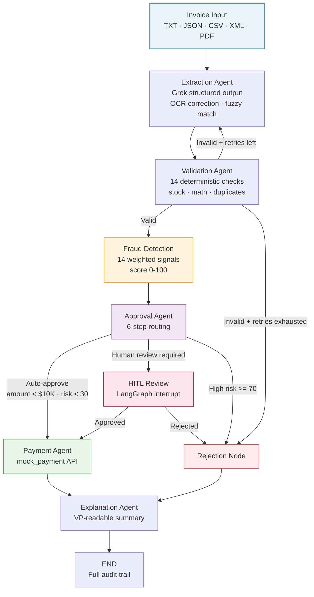

# Invoice Processing AI — Multi-Agent System for Automated AP Workflow

A production-ready multi-agent pipeline built with **LangGraph + Grok** that automates the full accounts-payable workflow: invoice ingestion → extraction → validation → fraud detection → approval → payment → audit trail. Includes a Flask HITL dashboard, CLI, and batch mode.

---

## Business Context

A PE-backed manufacturer was losing over $2M/year to manual invoice processing — a 5-day cycle time, a 30% error rate on line-item validation, and no systematic fraud detection. Duplicate invoices alone accounted for an estimated 2% in overpayments. This system replaces the manual workflow with a multi-agent AI pipeline that extracts structured data from any invoice format, runs deterministic business-rule checks, scores fraud risk across 14 signals, and routes borderline cases to a human reviewer in a purpose-built web interface — all in under 30 seconds per invoice.

---

## Architecture



The pipeline follows a directed workflow with self-correction loops:

1. **Extraction Agent** — Grok structured output with OCR correction and fuzzy item matching
2. **Validation Agent** — Deterministic database checks against SQLite inventory (no LLM)
3. **Fraud Detection** — 14 weighted signals scored to a 0–100 composite risk score
4. **Approval Agent** — 6-step rule-based routing: critical reject → high risk reject → validation escalation → warning escalation → auto-approve → HITL
5. **Payment Agent** — Mock transaction handling + invoice history recording
6. **Explanation Agent** — Grok generates VP-readable decision summaries

Routing includes retry loops (up to 3 attempts with structured feedback) for extraction failures and `interrupt()`-based human-in-the-loop checkpoints for mid-range risk cases.

---

## Key Design Decisions

| Decision | Rationale |
|----------|-----------|
| **LangGraph StateGraph** over linear chains | The pipeline has genuine cycles (validate → retry → re-extract) and multi-path routing (approve → payment or reject). These are first-class concepts in `StateGraph`, not workarounds. |
| **`interrupt()` for HITL** over simulated reviews | `interrupt()` + `MemorySaver` genuinely pauses the state machine and persists the checkpoint. The graph can resume hours later with the exact same state — this is what real enterprise HITL requires. |
| **Deterministic validation + fraud scoring** (no LLM) | Every validation check and fraud signal is pure Python so it's auditable, testable, and deterministic. A compliance team can review the exact rules; an LLM judgment is a black box. |
| **LLM only where it adds value** | Grok is called for 3 things: (1) unstructured text extraction, (2) fraud risk narratives, (3) VP-readable explanations. Everything else is rule-based. This minimises cost (~$0.02/invoice) and maximises reliability. |
| **Devil's-advocate reflection** on HITL escalation | Before presenting a case to the human reviewer, Grok challenges the escalation rationale — arguing the other side. This prevents rubber-stamp approvals and surfaces genuine ambiguity. |
| **SQLite over Postgres** | Right scope for a 3-week prototype. The schema is clean enough that swapping to Postgres is a config change, not a rewrite. |
| **Weighted fraud signals** (14 checks, 0-100 composite) | Each signal has an explicit weight and severity. The composite score is a `min(sum, 100)` — transparent and debuggable, unlike an LLM-generated risk score. |

---

## Setup

```bash
# 1. Clone and install
git clone https://github.com/sami2919/Invoice-Processing-Automation.git && cd Invoice-Processing-Automation
pip install -r requirements.txt

# 2. Configure API key
cp .env.example .env
# Edit .env and set XAI_API_KEY=xai-your-key-here

# 3. Initialise the database (auto-seeds inventory + vendors)
python -c "from src.database import init_db; init_db()"
```

---

## Usage

**Process a single invoice (CLI)**
```bash
python main.py --invoice_path data/invoices/invoice_1001.txt
```

**Batch processing with CSV export**
```bash
python main.py --batch data/invoices/ --auto-approve
# Outputs: batch_results_YYYYMMDD_HHMMSS.csv
```

**Auto-approve mode (no HITL prompts — useful for CI)**
```bash
python main.py --invoice_path data/invoices/invoice_1001.txt --auto-approve
```

**Web dashboard (recommended for demos)**
```bash
python web.py
# Opens at http://localhost:8501
```

**Docker**
```bash
docker build -t invoice-ai .
docker run -p 8501:8501 -e XAI_API_KEY=xai-your-key invoice-ai
# Open http://localhost:8501
```

---

## Features

| Feature | Detail |
|---------|--------|
| **Multi-format ingestion** | PDF (pdfplumber), CSV, JSON, XML, TXT |
| **Self-correction extraction** | Grok extraction failures feed back into a retry loop (up to 3 attempts) with targeted error context |
| **OCR artifact handling** | Letter-O vs zero, mangled decimals — corrected at extraction time |
| **Fuzzy item matching** | `difflib.SequenceMatcher` at 0.8 threshold maps "Widget A" → "WidgetA" |
| **Composite fraud scoring** | 14 weighted signals, score 0–100, three tiers: auto-approve / flag / block |
| **Human-in-the-loop** | LangGraph `interrupt()` + `MemorySaver` checkpointing — genuine pause/resume via web review panel |
| **Duplicate detection** | Invoice number cross-checked against `invoice_history` table (recorded on both approval and rejection) |
| **Aggregate stock check** | Sums quantities per item across all line items before comparing to inventory stock |
| **Currency enforcement** | Flags non-USD invoices for review |
| **Price variance detection** | >10% deviation from catalog price flagged as validation warning |
| **VP-readable explanations** | Grok generates plain-English summaries of every decision |
| **Batch processing** | Directory scan with stem-based dedup, progress bar, colour-coded results, CSV export |
| **Full audit trail** | Every agent action recorded with timestamp, duration, and confidence |
| **Web dashboard** | 4-tab UI: process, batch, analytics, audit trail + settings drawer |

---

## Business Impact

| Metric | Manual | Automated |
|--------|--------|-----------|
| Cost per invoice | ~$15 | ~$2.50 |
| Cycle time | 5 days | < 30 seconds |
| Error rate | ~30% | < 5% (AI validation + human oversight) |
| Duplicate detection | Reactive (after payment) | Proactive (before processing) |

**At 1,000 invoices/month:** ~$150,000 annual savings vs manual processing.

Fraud detection prevents duplicate payments (~2% overpayment rate). At $5M annual AP spend, that's $100,000+ in prevented overpayments. Combined with validation accuracy improvements, the system pays for itself within weeks of deployment.

---

## Test Matrix

| Invoice | Tests | Expected Result |
|---------|-------|-----------------|
| `INV-1001.txt` | Clean happy path | Approved |
| `INV-1002.txt` | Stock mismatch (GadgetX qty 20, stock 5) | Rejected |
| `INV-1003.txt` | Fraud signals: urgency language, wire transfer, "Fraudster LLC", zero-stock item | Rejected, high risk |
| `INV-1004.json` + `INV-1004_revised.json` | Duplicate invoice detection | Second flagged as duplicate |
| `INV-1005.json` | Unknown vendor + stock mismatch (GadgetX qty 8, stock 5) | Rejected |
| `INV-1006.csv` | Clean CSV format ingestion | Approved |
| `INV-1007.csv` | Stock mismatch (WidgetA qty 20, stock 15) | Rejected |
| `INV-1008.txt` | Unknown items (SuperGizmo, MegaSprocket) — all items unknown | Rejected |
| `INV-1009.json` | Negative quantity, empty vendor, null due date | Rejected |
| `INV-1010.txt` | Price variance (WidgetA at $250 regular + $300 rush) | Flagged for review |
| `INV-1011.pdf` | PDF ingestion via pdfplumber | Approved |
| `INV-1012.pdf` | OCR artifacts ("2O26", "3,500.O0", "Widget A") | Flagged — extraction resilience |
| `INV-1013.json` | Aggregate qty check (WidgetA 15+5+2=22, stock 15) | Rejected — stock mismatch |
| `INV-1014.xml` | Non-USD currency (EUR) | Flagged — currency warning |
| `INV-1015.csv` | Multi-line CSV with tax column | Approved |
| `INV-1016.json` | Unknown item (WidgetC) alongside valid items | Flagged for review |

Run with:
```bash
python main.py --batch data/invoices/ --auto-approve
```

---

## Test Suite

```bash
pytest tests/ -v
# 79 tests across 6 modules — approval, extraction, fraud, validation, pipeline routing, integration
```

Tests are fully isolated — an in-memory SQLite database is spun up per test and all Grok API calls are mocked. No API key required to run the test suite.

---

## What I'd Build Next

Framed through Galatiq's forward-deployment model:

- **3-way PO matching** — map invoice fields to purchase order IDs via SAP/NetSuite connector (PO → receipt → invoice). This is the #1 ask from real AP teams.
- **Grok Vision for scanned invoices** — bypass OCR entirely for paper invoices, passing the raw image to Grok's multimodal endpoint
- **A2A protocol** — expose the pipeline as an Agent-to-Agent endpoint so procurement systems can submit invoices programmatically
- **Slack / Teams notifications** — push HITL review requests directly to the approver's channel with one-click approve/reject
- **Fine-tuned extraction model** — train a lighter model on the client's historical invoice corpus to eliminate Grok calls for routine formats (80%+ of volume)
- **PostgreSQL + Redis** — replace SQLite with Postgres for multi-user concurrency; Redis for LangGraph checkpointing with persistent thread storage
- **LangGraph Cloud** — deploy to LangGraph's hosted runtime for scalable HITL with email/Slack interrupts
- **Multi-round reflection** — extend the current single-pass devil's-advocate to a full critique chain where Grok evaluates its own reflection, catching cases where the initial challenge is too weak or too aggressive

---

## Project Structure

```
├── web.py                        # Flask dashboard (process, batch, analytics, audit)
├── main.py                       # CLI entry point (single + batch modes)
├── templates/dashboard.html      # Tailwind + Chart.js UI
├── src/
│   ├── agents/                   # extraction, validation, fraud, approval, payment, explanation
│   ├── models/                   # Pydantic schemas (invoice, state, audit)
│   ├── llm/grok_client.py       # ChatXAI wrapper
│   ├── tools/                    # inventory_db, file_parser, payment_api, pdf_extractor
│   ├── pipeline.py               # LangGraph graph assembly
│   ├── processing.py             # Shared utilities (batch, HITL, record building)
│   ├── config.py                 # pydantic-settings (thresholds + API config)
│   └── database.py               # SQLite schema + seed data
├── tests/                        # extraction, validation, pipeline routing, E2E integration
├── data/invoices/                # 20 test invoices (TXT, JSON, CSV, XML, PDF)
├── Dockerfile
├── requirements.txt
└── .env.example
```
